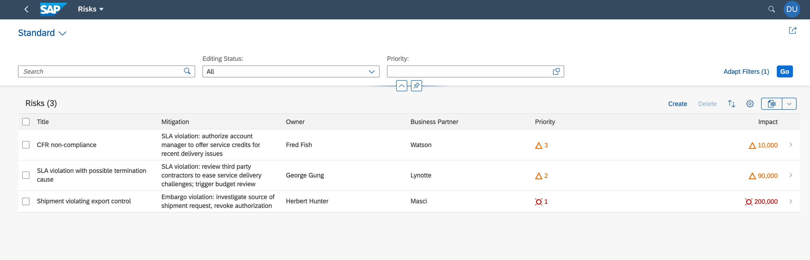

# DEV166 - Extend SAP S/4HANA with SAP Extension Suite

## Description

This repository contains the material for the SAP TechEd 2020 session called DEV166 - Extend SAP S/4HANA with SAP Extension Suite.  

## Overview

This session introduces attendees to an end-to-end flow to build an extension using best practices from SAP Extension Suite.

This workshop will guide you step-by-step through the process of 
- creating new data models and a service using the SAP Cloud Application Programming Model (CAP)
- integrating a service exposed on the SAP API Business Hub
- creating a List Report Object Page application based on Fiori elements (FE) using the new service
- configuring and running a predefined Continuous Integration and Delivery (CI/CD) pipeline that automatically tests, builds, and deploys your code changes to the SAP Business Technology Platform (BTP)

Please note that the inclusion of a service displayed in the SAP API Business Hub originates from a S/4 HANA Cloud system. While large parts of the tutorial are directed to consume the service from a real S/4 HANA Cloud system, the service will eventually not be consumed from a real system but from its local copy on the SAP BTP. This is because within this tutorial and using a SAP BTP trial account, no real S/4HANA Cloud system can be provided and configured.

This is what the final application will look like:

## Requirements

The requirements to follow the exercises in this repository are:
- Get a free trial account on SAP BTP; see this [tutorial](https://developers.sap.com/tutorials/hcp-create-trial-account.html). Choose Europe (Frankfurt) - AWS or US East (VA) - AWS regions. Alternatively, you can also watch this [video](https://www.youtube.com/watch?v=n5luSQKYvQQ&feature=youtu.be) to set up your trial account.
- Set up SAP Business Application Studio for development; see this [tutorial](https://developers.sap.com/tutorials/appstudio-onboarding.html).

## Exercises

- [Getting Started](exercises/ex0/)
- [Exercise 1 - Create a Cloud Application Programming Model Service and a Fiori Elements Application](exercises/ex1/)
    - [Exercise 1.1 - Create a CAP-Based Service](exercises/ex1#exercise-11-create-a-cap-based-service)
    - [Exercise 1.2 - Create an SAP Fiori Elements-Based Application](exercises/ex1#exercise-12-create-an-sap-fiori-elements-based-application)
    - [Exercise 1.3 - Add Business Logic to Your Application](exercises/ex1#exercise-13-add-business-logic-to-your-applicat)
    - [Exercise 1.4 - Add the Consumption of an External Service Exposed by SAP API](exercises/ex1#exercise-14-add-the-consumption-of-an-external-service-exposed-by-sap-api-business-hub-to-your-service)
    - [Exercise 1.5 - Consume the External Service in Your UI Application](exercises/ex1#exercise-15-consume-the-external-service-in-your-ui-application)
    - [Exercise 1.6 - Roles and Authorization Checks In CAP](exercises/ex1#exercise-16--roles-and-authorization-checks-in-cap)
- [Exercise 2 - Prepare for SAP BTP Deployment](exercises/ex2/)
    - [Exercise 2.1 - Prepare for SAP HANA Deployment](exercises/ex2#exercise-21-prepare-for-sap-hana-deployment)
    - [Exercise 2.2 - Prepare User Authentication and Authorization (XSUAA) Setup](exercises/ex2#exercise-22-prepare-user-authentication-and-authorization-xsuaa-setup)
    - [Exercise 2.3 - Create a "Multi Target Application" (MTA) File for Deplyment](exercises/ex2#exercise-23-create-a-multi-target-application-mta-file-for-deplyment)
    - [Exercise 2.4 - Add Authorization and Trust Management Service (XSUAA)](exercises/ex2#exercise-24--add-authorization-and-trust-management-service-xsuaa)
    - [Exercise 2.5 - Add an Application Router](exercises/ex2#exercise-25--add-an-application-router)
    - [Exercise 2.6 - Add UI and AppRouter Module to mta.yaml](exercises/ex2#exercise-26-add-ui-and-approuter-module-to-mtayaml)
    - [Exercise 2.7 - Remove Access for S/4 System](exercises/ex2#exercise-27-remove-access-for-s4-system)
- [Exercise 3 - Connect Your Project to SAP Continuous Integration and Delivery](exercises/ex3/)
    - [Exercise 3.1 - Create a GitHub Repository](exercises/ex3#exercise-31-create-a-github-repository)
    - [Exercise 3.2 - Create a Personal Access Token for GitHub](exercises/ex3#exercise-32-create-a-personal-access-token-for-github)
    - [Exercise 3.3 - Connect Your GitHub Repository with Your CAP Project](exercises/ex3#exercise-33-connect-your-github-repository-with-your-cap-project)
    - [Exercise 3.4 - Enable SAP Continuous Integration and Delivery](exercises/ex3#exercise-34-enable-sap-cloud-platform-continuous-integration-and-delivery)
    - [Exercise 3.5 - Configure Credentials in SAP Continuous Integration and Delivery](exercises/ex3#exercise-35-configure-credentials-in-sap-cloud-platform-continuous-integration-and-delivery)
    - [Exercise 3.6 - Configure a CI/CD Job](exercises/ex3#exercise-36-configure-a-cicd-job)
    - [Exercise 3.7 - Configure the Stages of Your CI/CD Pipeline](exercises/ex3#exercise-37-configure-the-stages-of-your-cicd-pipeline)
    - [Exercise 3.8 - Verify the Success of Your Build](exercises/ex3#exercise-38-verify-the-success-of-your-build)
    - [Exercise 3.9 -  Assign Role Collections and Access the Deployed Application](exercises/ex3#exercise-39-assign-role-collections-and-access-the-deployed-application)

## How to obtain support

Support for the content in this repository is available during the actual time of the online session for which this content has been designed. Otherwise, you may request support via the [Issues](../../issues) tab.

## License
Copyright (c) 2020 SAP SE or an SAP affiliate company. All rights reserved. This file is licensed under the Apache Software License, version 2.0 except as noted otherwise in the [LICENSE](LICENSES/Apache-2.0.txt) file.
