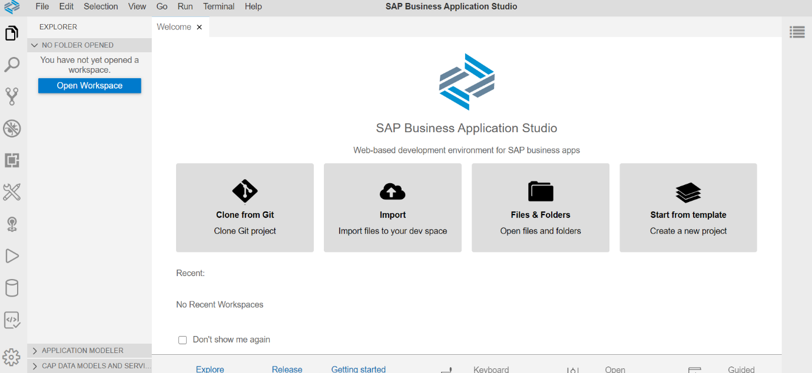

# Getting Started - Setting up your development environment

Welcome to the workshop 'Extend SAP S/4HANA with SAP Cloud Platform Extension Suite'.\
This workshop will guide you step-by-step through the process of 
- creating new data models and a service using the Cloud Application Programming Model (CAP)
- integrating a service from the [SAP API Business Hub](https://api.sap.com/)
- creating a List Report Object Page application based on Fiori elements (FE) using the new service
- configuring and running a predefined continuous integration and delivery (CI/CD) pipeline that automatically tests, builds, and deploys your code changes to the SAP Cloud Platform

## Set up Business Application Studio in an SAP Cloud Platform Trial Account

If you don't have an SAP Cloud Platform account already, you can create your own [here].(https://www.sap.com/products/cloud-platform/get-started.html).

### New Trial Users

1. After having registered your new user, start your trial via [this link](https://account.hanatrial.ondemand.com/register)\
2. Logging in for the first time, you'll be asked to select your preferred region. To be able to perform all exercises in this tutorial, select either Europe (Frankfurt) - AWS or US East (VA) - AWS.
This will start the set up of your account.

Your subaccount, org and space are created automatically, along with the necessary role configurations and subscriptions.\
3. When this is done, the subaccount overview page is shown.

### Existing Trial Users

1. In your subaccount, choose **Subscriptions** in the left-hand navigation.\
2. Choose **SAP Business Application Studio** in the list of available subscriptions.\
Choose **Subscribe**.\
3. Navigate back to your subaccount overview page.

### Access SAP Business Application Studio

Click on the Quick Tool Access icon **SAP Business Application Studio**.

## Create Dev Space

Click on the button **Create Dev Space**.

Enter a name for your dev space and select profile **SAP Cloud Business Application**.

In the lower right corner of the page press button **Create Dev Space**.

 

Once your dev space has status running, click on the development space name to open it.

You should now see such a screen:

## Summary

With the setup procedure done, you now have completed:
- setting up the SAP Cloud Platform trial account
- Access to SAP Business Application Studio (SBAS)
- Creation of your dev space

Continue to - [Exercise 1](../ex1/README.md)
