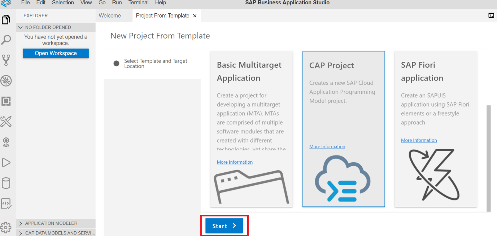

# Exercise 1 - Exercise 1 Description

In this exercise, we will create an application based on a data model and service created using the Cloud Application Programming Model (CAP) and a UI based on Fiori elements (FE) which in turn is based on UI5.


## Exercise 1.1 Create a CAP-Based Service

In this part, you create a new CAP-based service, which exposes the OData V4 protocol. To do so, you use CAP's tooling `cds init` and `cds watch` in a terminal.

### Create and Initialize the Project

1. In the Business Application Studio click on **Create project from template**

2. Select **CAP Project** and press **Next**

3. Enter 'RiskManagement' as a project name. Don't tick any of the checkboxes below.

4. After the project has been generated, click on **Open in New Workspace** on the pop up in the lower right corner

5. The new workspace will open and it will show the generated 'RiskManagement' project like this:


6. In VS Code choose **Terminal -> New Terminal** from its menu.

    A new terminal opens in the lower right part of the VS Code screen.

7. In the terminal, start a CAP server by typing:
    ```
    cds watch
    ```
    The CAP server serves all the CAP sources from your project. It also "watches" all the files in your projects and conveniently restarts the server whenever you save a file. Changes you've made, will immediately be served without you having to do anything.

    The screen now looks like this:
    
    Cds watch tells you that there’s no model yet that it can serve. You add one in the next steps.

### Add a Data Model to the Project

In this part we create a data model using the Core Data Services (CDS) format from CAP.

1. In the project, go to folder **db**, representing the data model on the data base, press the right mouse button and select **New File** in the menu
2. Enter **schema.cds*** as a name.
3. Click on the new file in the explorer, an editor opens
4. Enter the following lines into the editor

```javascript
namespace sap.ui.riskmanagement;
using { managed } from '@sap/cds/common';

  entity Risks : managed {
    key ID      : UUID  @(Core.Computed : true);
    title       : String(100);
    owner       : String;
    prio        : String(5);
    descr       : String;
    miti        : Association to Mitigations;
    impact      : Integer;
    //bp          : Association to BusinessPartners;
    criticality : Integer;
  }

  entity Mitigations : managed {
    key ID       : UUID  @(Core.Computed : true);
    description  : String;
    owner        : String;
    timeline     : String;
    risks        : Association to many Risks on risks.miti = $self;
  }
```

5. Save the file

    This creates 2 entities in the namespace **sap.ui.riskmanagement**, **Risks**, and **Mitigations**. Each of them have a key called **ID** and several other properties. a Risk has a mitigation and therefore, the property **miti** has an association to exactly one Mitigation. A Mitigation in turn can be used for many Risks, so it has a "too many" association. They key is automatically filled by CAP, which is exposed to the user of the service with the annotation `@(Core.Computed : true)`.

    At this point, you can neglect the commented property **bp** (as well as the other commented lines further down in the file). All the commented lines are later used and uncommented when you introduce a reference to a Business Partner entity. For now you don't need it, though.

    The screen now looks like this:


    Notice how cds watch reacted to dropping the file. It now tells you that it has a model but there are no service definitions yet and thus it still can’t serve anything. So, you add a service definition.

### Add a Service to the Project

In this part we create a new service with 2 entities, both are projections of the data models that we created in the chapter before.

1. In the project, go to folder **srv**, representing the service, press the right mouse button and select **New File** in the menu
2. Enter **risk-service.cds*** as a name.
3. Click on the new file in the explorer, an editor opens
4. Enter the following lines into the editor

```javascript
using { sap.ui.riskmanagement as my } from '../db/schema';

@path: 'service/risk'
service RiskService {
  entity Risks as projection on my.Risks;
    annotate Risks with @odata.draft.enabled; 
  entity Mitigations as projection on my.Mitigations;
    annotate Mitigations with @odata.draft.enabled;
  //entity BusinessPartners as projection on my.BusinessPartners; 
}
```

  This creates a new service **RiskService** in the namespace **sap.ui.riskmanagement**. This service exposes 2 entities (again just neglect the commented part for the business partner), **Risks**and **Mitigations**, which are both just exposing the entities of the data base schema you’ve created in the step before.

  If you again look at the terminal, you see that cds watch has noticed the new file and now tells us that it serves something:


5. Press the **Expose and Open** button
6. If you are asked to enter a name just press return

You now see this screen:


7. Click the **$metadata** link 

The service already exposes a full blown OData metadata document

8. Now click on the **Risks** link.

This exposes the data for the Risks entity. As there is no data yet, you only see this:

```javascript
{
    @odata.context: "$metadata#Risks",
    value: [ ]
}
```

Don't close the window, you will need it again.

### Add Data for the service
 
In this part we add data to the service. It is local data that is stored in a local data base called SQLite that CAP invokes behind the scences. CAP makes it easy to add such test data to a service, all it needs is a Comma Separated Values file which contains the entities' elements as column headers.

1. In the project, go to folder **db**, , press the right mouse button and select **New Folder** in the menu
2. Enter **data** as a name.
3. On the **data** folder,press the right mouse button and select **New File** in the menu
2. Enter **sap.ui.riskmanagement-Risks.csv** as a name.
5. Click on the new file in the explorer, an editor opens
6. Enter the following lines into the editor

```csv
ID;createdAt;createdBy;title;prio;descr;miti_id;impact
20466922-7d57-4e76-b14c-e53fd97dcb11;2019-10-24;tim.back@sap.com;CFR non-compliance ;3;Recent restructuring might violate CFR code 71;20466921-7d57-4e76-b14c-e53fd97dcb11;10000
20466922-7d57-4e76-b14c-e53fd97dcb12;2019-10-24;tim.back@sap.com;SLA violation with possible termination cause;2;Repeated SAL violation on service delivery for two successive quarters;20466921-7d57-4e76-b14c-e53fd97dcb12;90000
20466922-7d57-4e76-b14c-e53fd97dcb13;2019-10-24;tim.back@sap.com;Shipment violating export control;1;Violation of export and trade control with unauthorized downloads;20466921-7d57-4e76-b14c-e53fd97dcb13;200000
```
7. Save the file
38 On the **data** folder,press the right mouse button and select **New File** in the menu
8. Enter **sap.ui.riskmanagement-Mitigations.csv** as a name.
9. Click on the new file in the explorer, an editor opens
10. Enter the following lines into the editor

```csv
ID;createdAt;createdBy;description;owner;timeline
20466921-7d57-4e76-b14c-e53fd97dcb11;2019-10-24;tim.back@sap.com;SLA violation: authorize account manager to offer service credits for recent delivery issues;suitable BuPa;Q2 2020
20466921-7d57-4e76-b14c-e53fd97dcb12;2019-10-24;tim.back@sap.com;"SLA violation: review third party contractors to ease service delivery challenges; trigger budget review";suitable BuPa;Q3 2020
20466921-7d57-4e76-b14c-e53fd97dcb13;2019-10-24;tim.back@sap.com;Embargo violation: investigate source of shipment request, revoke authorization;SFSF Employee with link possible?;29.03.2020
20466921-7d57-4e76-b14c-e53fd97dcb14;2019-10-24;tim.back@sap.com;Embargo violation: review shipment proceedure and stop delivery until further notice;SFSF Employee with link possible?;01.03.2020
```
11. Save the file

The fils have the name of the namespace of the entities in the data model (e.g. **sap.ui.riskmanagement**), followed by a '-' and the name of the entity (e.g. **Risks**). When adhering to this naming convention CAP recognizes the file as data for the data model and automatically adds it to the built in SQLite data base.
Looking at the contents of the file **sap.ui.riskmanagement-Risks.csv**, the first line contains all the properties from your **Risks** entity. While the other ones are straight forward, consider the **miti_id** property. In your entity, you only have a **miti** property, so where does this come from? **miti** is an association to **Mitigations**, as **Mitigations** could have several key properties, the association on the data base needs to point to all of these, therefore CAP creates a property **<AssocuiationProperty>_<AssociatedEntityKey>** for each key.

As always `cds watch` has noticed the change.

12. Return to the browser window wehere the service is stil shown and press **refresh** in the browser. it will now show values for **Risks**


And that's it: You’ve now got a full blown OData service, which complies to the OData standard and supports the respective queries without having to code anything but the data model and exposing the service itself.

*Note:* The service is completely exposed without any authentication or authorization check. you extend the service later with such checks.


## ###############################################################

## Exercise 1.1 Sub Exercise 1 Description

After completing these steps you will have created...

1. Click here.
<br>

2.	Insert this line of code.
```abap
response->set_text( |Hello World! | ). 
```


## Exercise 1.2 Sub Exercise 2 Description

After completing these steps you will have...

1.	Enter this code.
```abap
DATA(lt_params) = request->get_form_fields(  ).
READ TABLE lt_params REFERENCE INTO DATA(lr_params) WITH KEY name = 'cmd'.
  IF sy-subrc <> 0.
    response->set_status( i_code = 400
                     i_reason = 'Bad request').
    RETURN.
  ENDIF.

```

2.	Click here.
<br>


## Summary

You've now ...

Continue to - [Exercise 2 - Exercise 2 Description](../ex2/README.md)

