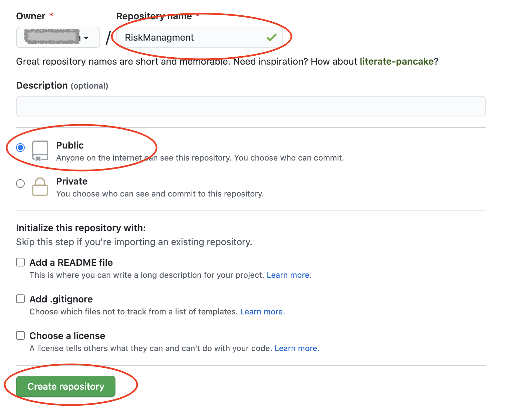
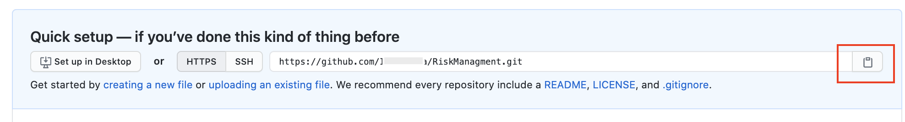

# Exercise 2 - Deploy the Application to SAP CP 

In this exercise, we will configure and run a configure and run predefined continuous integration and delivery (CI/CD) pipelines that automatically test, build, and deploy your code changes to speed up your development and delivery cycles.


## Exercise 2.1 Create a GitHub Project 

After completing these steps you will have created a project in the public GitHub where you can store the source code of your project. You need to have a user in the public GitHub to execute the steps below.

1. Open https://github.com/ and sign in with your user.

2. Click on *New* in the 'Repository' tab to create a new repository.

   
   
3. Enter the name of the repository. Use ‘RiskManagment’. Do not check the checkbox 'Intialize this repository with a README'.
4. Click on create repository.



5. Copy the github url of the newly created Git repository.

   


TODO: Checkin Project Sources

## Exercise 2.2 Configure and Run a Pipeline

After completing these steps you will have subscribed to SAP Cloud Platform Continuous Integration and Delivery and will have configured and run a predefined pipeline for your project.

1.	Open-up your SAP Cloud Platform trial account and create a sub-account in one of the following regions – Europe (Frankfurt) – AWS or US East (VA) – AWS.

You will see the SAP Cloud Platform Continuous Integration and Delivery in the Subscriptions Tab.

   

2. Click on the service and subscribe to it.

  

3. Grant your user the `CICD Service Administrator` role role. To do so, follow these steps:

3.1. In your subaccount in the SAP Cloud Platform cockpit, choose `Security`, then click on `Trust Configuration`.
3.2. Choose the name of your identity provider.
Enter your e-mail address
3.3. Choose `Show Assignments`.
If the user is new to the subaccount, choose Add User in the Confirmation dialog.
3.4. Choose `Assign Role Collection`.
3.5. From the dropdown list, select the `CICD Service Administrator` role.

4. Access the `SAP Cloud Platform Continuous Integration and Delivery` via the link `Go to Application` in the  `Continuous Integration and Delivery Service Tile`.

5. In the `GitHub` repository of your project create a folder named `.pipeline`, which contains a file named `config.yml`. In the `config.yml` file, add the following initial configuration:

```PipelineConfiguration
# Project configuration
general:

# Stage configuration
stages:
  productionDeployment:
    cfTargets:
    - org: '<YOUR ORG NAME>'
      space: '<YOUR SPACE NAME>'
      appName: '<NAME OF YOUR APPLICATION>'
      apiEndpoint: '<YOUR CLOUD FOUNDRY API ENDPOINT>'
      credentialsId: '<NAME OF YOUR CEDENTIAL>'
```

6. Replace the placeholders with the values of the target space in the Cloud Foundry environment to which you want to deploy.

7. Commit the changes to `GitHub`.

## Summary

You've now ...

Continue to - [Exercise 3 - Excercise 3 ](../ex3/README.md)
